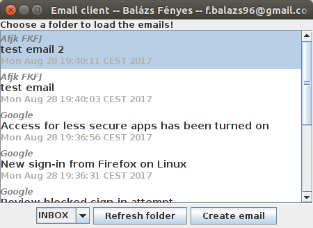
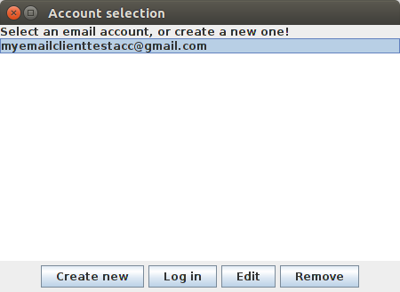

# email-client

Simple email client made using JavaMail, functionality: folders, writing emails with attachments, multiple account information can be stored with encrypted passwords

Used libraries:

* [JavaMail 1.5](https://java.net/projects/javamail/pages/Home)

Screenshots:

